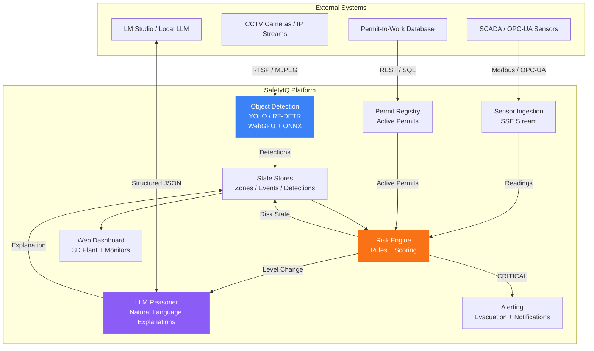
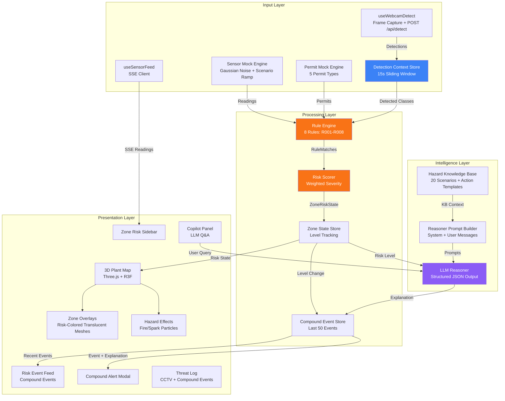
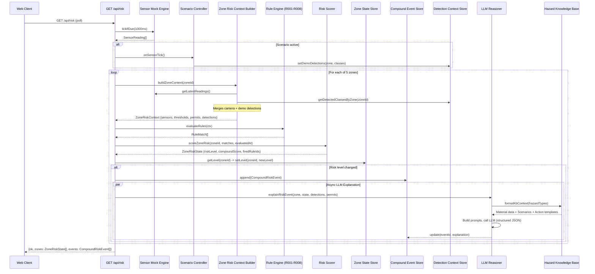
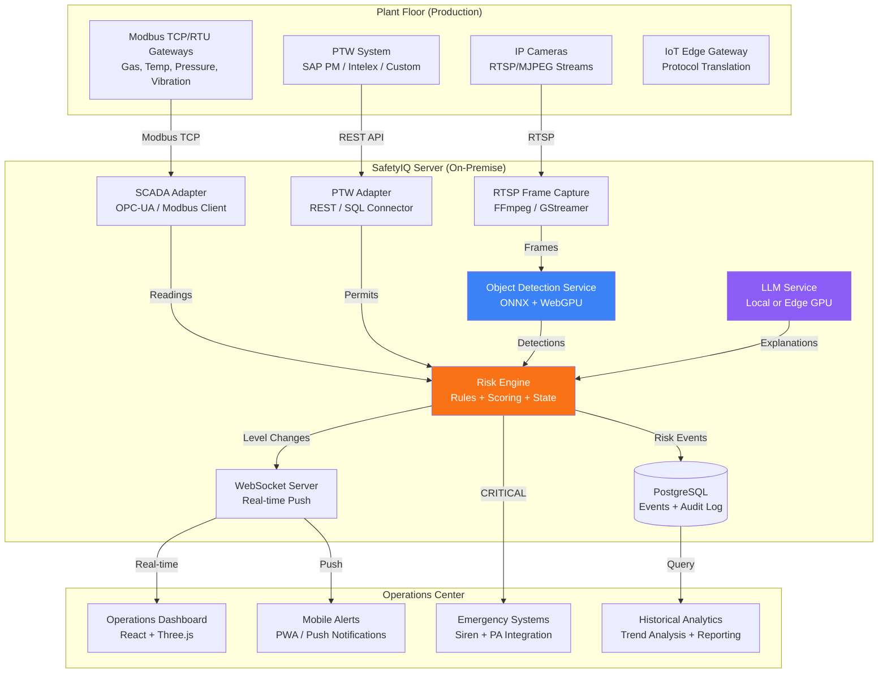
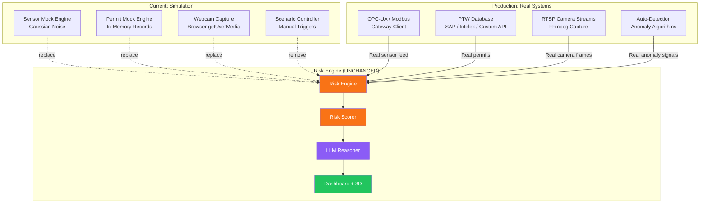
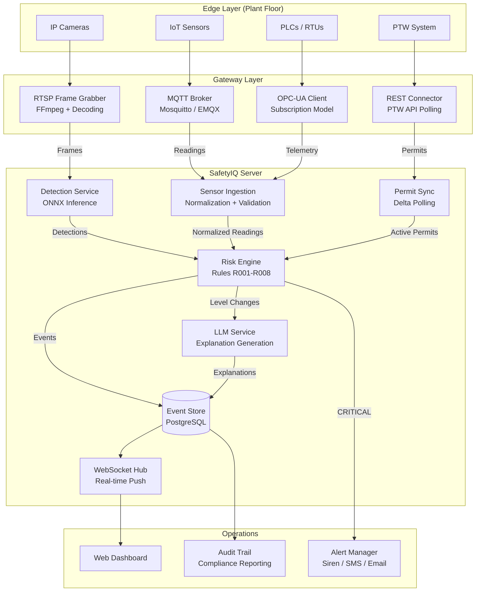

# SafetyIQ -- Technical Documentation

> **Compound Risk Detection for Industrial Environments**
> Version 0.2.0 | GPL-2.0 License

---

## Table of Contents

1. [Executive Summary](#1-executive-summary)
2. [System Overview](#2-system-overview)
3. [Architecture](#3-architecture)
4. [Core Subsystems](#4-core-subsystems)
   - 4.1 [Compound Risk Engine](#41-compound-risk-engine)
   - 4.2 [SCADA Sensor Simulation](#42-scada-sensor-simulation)
   - 4.3 [Permit-to-Work System](#43-permit-to-work-system)
   - 4.4 [CCTV Vision Pipeline](#44-cctv-vision-pipeline)
   - 4.5 [Hazard Knowledge Base](#45-hazard-knowledge-base)
   - 4.6 [LLM Reasoning Layer](#46-llm-reasoning-layer)
   - 4.7 [Scenario Simulation](#47-scenario-simulation)
5. [Plant Zone Layout](#5-plant-zone-layout)
6. [Risk Rules Reference](#6-risk-rules-reference)
7. [API Reference](#7-api-reference)
8. [Technology Stack](#8-technology-stack)
9. [Simulation-to-Production Mapping](#9-simulation-to-production-mapping)
10. [Demo Walkthrough](#10-demo-walkthrough)
11. [Development Setup](#11-development-setup)

---

## 1. Executive Summary

Industrial facilities operate under constant risk. A gas leak in one zone, a hot work permit active in another, and a person detected near both -- individually, these are manageable conditions. Together, they form a **compound hazard** that traditional siloed monitoring systems fail to detect.

**SafetyIQ** is a real-time compound risk detection system that fuses three independent signal streams -- **CCTV visual detections**, **SCADA sensor telemetry**, and **permit-to-work (PTW) status** -- into a unified risk evaluation engine. When multiple risk factors co-occur within a plant zone, SafetyIQ detects the compound hazard, calculates a severity score, and generates natural language explanations with recommended emergency actions.

### Key Capabilities

- **Compound Risk Detection**: Eight rules that evaluate cross-signal combinations (sensor + permit + visual) to identify hazards that no single system would flag.
- **Real-Time Processing**: Sensor data ingested via SSE at 1 Hz; risk evaluated on every tick; camera detections maintained in a 15-second sliding window.
- **AI-Powered Explanations**: LLM-generated risk narratives grounded in a curated hazard knowledge base of 20 real-world scenarios referenced from OSHA, NFPA, ASME, and API standards.
- **3D Plant Visualization**: Interactive Three.js digital twin with risk-colored zone overlays, particle effects for active hazards, and animated personnel.
- **Local Inference**: YOLOv11 and RF-DETR object detection running entirely on-device via WebGPU with ONNX Runtime -- no cloud dependency for vision.
- **Production-Ready Architecture**: The current system uses simulated sensors and webcam feeds, but every component is designed so that inputs can be swapped to real SCADA/OPC-UA feeds, RTSP camera streams, and enterprise PTW databases without modifying the core risk engine.

### Problem Statement

According to the U.S. Bureau of Labor Statistics, there were 5,486 workplace fatalities in 2022. Many incidents share a pattern: multiple low-to-moderate risk conditions co-exist in the same area, and the compound effect is not surfaced by any individual monitoring system. SafetyIQ addresses this gap by correlating signals across domains in real time.

---

## 2. System Overview

SafetyIQ operates as a **multi-signal fusion platform** with three input streams feeding a central risk evaluation engine:

```
CCTV Cameras  -->  Object Detection (YOLO/RF-DETR)  -->  Detection Context Store
                                                              |
SCADA Sensors  -->  Sensor Feed (SSE)  ------------------>  Zone Risk Context
                                                              |
PTW Database   -->  Permit Registry  ------------------->  Zone Risk Context
                                                              |
                                              Rule Engine (R001-R008)
                                                              |
                                                    Risk Scorer
                                                              |
                                              Zone State Tracking
                                                              |
                                            LLM Reasoner (LM Studio)
                                                              |
                                            3D Dashboard / Alerts
```

### Core Design Principles

1. **Signal Independence**: Each input stream is independently validated. A risk event requires corroboration from at least two signal types.
2. **Temporal Coherence**: Camera detections are maintained in a 15-second sliding window (`app/api/risk/_lib/detection-context-store.ts:3`), ensuring that transient detections contribute to risk evaluation only while they remain plausible.
3. **Deterministic Fallback**: Every LLM call has a timeout (configurable, default 8 seconds). If the LLM fails, a deterministic template-based explanation is generated from the same rule and sensor data (`app/api/risk/_lib/llm-reasoner.ts:47-66`).
4. **Graceful Degradation**: The system operates in three modes -- full (LLM + vision + sensors), vision-only (no SCADA), and simulation-only (demo mode with mock data).

---

## 3. Architecture

### 3.1 System Context Diagram



### 3.2 Component Architecture



### 3.3 Risk Evaluation Sequence Diagram



### 3.4 Production Architecture



---

## 4. Core Subsystems

### 4.1 Compound Risk Engine

The risk engine is the central processing unit of SafetyIQ. It evaluates plant zones against a set of deterministic rules, calculates compound risk scores, and triggers LLM-powered explanations when risk levels change.

#### Pipeline

1. **Context Assembly** (`app/api/risk/route.ts:21-55`): For each zone, build a `ZoneRiskContext` containing current sensor readings, active permits, and detected object classes from cameras.
2. **Rule Evaluation** (`app/api/risk/_lib/rule-engine.ts`): Run all 8 rules against the context. Each rule returns `null` (no match) or a `RuleMatch` with severity, contributing signals, and description.
3. **Risk Scoring** (`app/api/risk/_lib/risk-scorer.ts:12-48`): Aggregate rule matches into a `ZoneRiskState` with a weighted compound score.
4. **State Tracking** (`app/api/risk/_lib/zone-state-store.ts`): Compare new risk level to previous. If changed, create a `CompoundRiskEvent` and trigger async LLM explanation.
5. **Event Storage** (`app/api/risk/_lib/zone-state-store.ts:33-60`): Store up to 50 recent events with their LLM explanations.

#### Scoring Algorithm

The compound score is a severity-weighted sum of all fired rules:

| Severity  | Weight | Rationale |
|-----------|--------|-----------|
| WARNING   | 5      | Low-confidence, monitoring-level signal |
| HIGH      | 20     | Active hazard requiring intervention |
| CRITICAL  | 40     | Imminent danger, immediate action required |

**Special case**: When 2 or more CRITICAL rules fire simultaneously in the same zone, the compound score is forced to 100 regardless of the arithmetic sum.

```
compoundScore = sum(firedRules.map(r => SCORE_WEIGHTS[r.severity]))
if criticalCount >= 2: compoundScore = 100
else: compoundScore = min(100, compoundScore)
```

The risk level is determined by the **highest severity** among all fired rules (not the score):

| Compound Score | Risk Level |
|----------------|------------|
| 0              | NOMINAL    |
| Any match      | Max severity of matches |

#### Contributing Signals

Each fired rule produces `ContributingSignal` entries of three types:

| Signal Type | Source | Example |
|-------------|--------|---------|
| `sensor`    | SCADA readings | `GAS-Z3: 82.3ppm (threshold: 70ppm)` |
| `permit`    | PTW system | `Hot Work Permit active` |
| `detection` | CCTV vision | `Person detected (cam-3)` |

Signals are deduplicated across rules using a `type:label` composite key, ensuring each unique signal appears once in the final event.

#### Type Definitions

```typescript
// app/lib/compound-risk-types.ts

interface ZoneRiskContext {
  zoneId: string;
  zoneName: string;
  hazardClass: string;
  detectedClasses: string[];
  sensors: Record<string, number>;
  thresholds: Record<string, number>;
  activePermits: string[];
}

interface ZoneRiskState {
  zoneId: string;
  riskLevel: "NOMINAL" | "WARNING" | "HIGH" | "CRITICAL";
  compoundScore: number;
  firedRuleIds: string[];
  contributingSignals: ContributingSignal[];
  evaluatedAt: string;
}

interface CompoundRiskEvent {
  id: string;
  zoneId: string;
  zoneName: string;
  previousLevel: RiskLevel;
  newLevel: RiskLevel;
  firedRules: string[];
  contributingSignals: ContributingSignal[];
  llmExplanation: string | null;
  immediateActions: string[];
  evacuationRequired: boolean;
  timestamp: string;
}
```

---

### 4.2 SCADA Sensor Simulation

The sensor mock engine (`app/api/sensors/_lib/sensor-mock-engine.ts`) simulates seven industrial sensors across five plant zones, producing realistic telemetry with Gaussian noise drift and scenario-based ramping.

#### Sensor Definitions

| Sensor ID | Name | Zone | Unit | Nominal Range | Warning | Critical |
|-----------|------|------|------|---------------|---------|----------|
| GAS-Z3 | Combustible Gas | Zone 3 | ppm | 0--10 | 25 | 70 |
| GAS-Z1 | Combustible Gas | Zone 1 | ppm | 0--10 | 25 | 70 |
| TEMP-U2 | Unit 2 Temperature | Zone 2 | celsius | 40--75 | 85 | 95 |
| TEMP-Z3 | Zone 3 Ambient Temp | Zone 3 | celsius | 20--35 | 45 | 60 |
| PRES-Z1 | Zone 1 Pressure | Zone 1 | bar | 2--6 | 8.5 | 10 |
| VIB-U2 | Unit 2 Vibration | Zone 2 | g | 0--2 | 4.5 | 6 |
| VIB-U4 | Unit 4 Vibration | Zone 4 | g | 0--2 | 4.5 | 6 |

Defined in `app/lib/sensor-definitions.ts`.

#### Simulation Modes

The engine operates in one of four modes:

| Mode | Behavior |
|------|----------|
| `NOMINAL` | Sensors drift around midpoints with Gaussian noise `N(0, 0.3)` |
| `SCENARIO_A` | GAS-Z3 ramps to 85 ppm over 30 ticks |
| `SCENARIO_B` | TEMP-U2 ramps to 92C over 25 ticks, VIB-U2 ramps to 5.8g over 10 ticks |
| `SCENARIO_C` | PRES-Z1 ramps to 9.2 bar over 19 ticks |

#### Nominal Midpoints

```typescript
// app/api/sensors/_lib/sensor-mock-engine.ts
const NOMINAL_MIDPOINTS = {
  "GAS-Z3": 8,    // ppm
  "GAS-Z1": 8,    // ppm
  "TEMP-U2": 65,  // celsius
  "TEMP-Z3": 28,  // celsius
  "PRES-Z1": 5.2, // bar
  "VIB-U2": 1.1,  // g
  "VIB-U4": 0.9,  // g
};
```

#### Noise Model

- **Nominal drift**: `gaussianNoise(0, 0.3)` per tick -- small random walk
- **Scenario ramp**: Linear interpolation from midpoint to target, with `gaussianNoise(0, 1.2)` added at each step
- **Initial value**: Midpoint + `gaussianNoise(0, 0.5)`
- Values are clamped to `[nominalMin * 0.5, target + 5]` to prevent unrealistic readings

#### SSE Stream

Sensor readings are delivered to the client via Server-Sent Events at `GET /api/sensors`:

```typescript
// app/api/sensors/route.ts
const TICK_MS = Number(process.env.SENSOR_TICK_INTERVAL_MS ?? 1000);
// Streams SensorReading[] every TICK_MS
```

Each reading includes:
```typescript
interface SensorReading {
  sensorId: string;
  value: number;        // Rounded to 1 decimal
  unit: SensorUnit;
  status: SensorStatus; // "nominal" | "warning" | "critical" | "offline"
  timestamp: string;    // ISO 8601
}
```

The `sensorStatusForValue()` function (`app/lib/sensor-types.ts`) maps readings to status by comparing against the sensor's warning and critical thresholds.

---

### 4.3 Permit-to-Work System

The permit mock engine (`app/api/permits/_lib/permit-mock-engine.ts`) simulates an enterprise Permit-to-Work system with five permit types and an issuance/expiry lifecycle.

#### Permit Types

| Type | Display Name | Typical Zone |
|------|-------------|--------------|
| `hot_work` | Hot Work Permit | Zone 3 (flammable) |
| `maintenance` | Maintenance Work Order | Zone 2 (mechanical) |
| `chemical` | Chemical Handling Permit | Zone 1 (chemical) |
| `confined_space` | Confined Space Entry | Zone 5 (general) |
| `electrical` | Electrical Isolation | Zone 4 (electrical) |

#### Default Active Permits

On startup, two permits are active:

1. **Chemical Handling Permit** in Zone 1, issued by J. Martinez
2. **Electrical Isolation** in Zone 4, issued by R. Chen

Both are valid for 8 hours from issuance.

#### Permit Record Structure

```typescript
interface PermitRecord {
  id: string;           // "ptw-{nanoid(8)}"
  zoneId: string;
  permitType: PermitType;
  displayName: string;
  issuedBy: string;
  issuedAt: string;     // ISO 8601
  validUntil: string;   // ISO 8601
  status: "active" | "expired" | "suspended";
}
```

#### Scenario Integration

When a scenario is triggered, the permit engine automatically issues the relevant permit:

| Scenario | Permit Issued | Zone | Issued By |
|----------|---------------|------|-----------|
| A | Hot Work Permit | Zone 3 | A. Singh |
| B | Maintenance Work Order | Zone 2 | K. Okafor |
| C | (None -- chemical permit already active) | Zone 1 | J. Martinez |

Permits can also be manually toggled via `POST /api/permits/toggle`.

---

### 4.4 CCTV Vision Pipeline

SafetyIQ runs object detection entirely locally using ONNX models accelerated by WebGPU, with CPU fallback. The pipeline processes camera frames, identifies objects of interest (persons, vehicles, equipment, PPE), and feeds detections into the risk engine.

#### Detection Models

| Model | File | Input Size | Capabilities |
|-------|------|------------|--------------|
| RF-DETR Segmentation Nano | `public/models/rf-detr-seg-nano.onnx` | 312x312 | Object detection + instance segmentation masks |
| YOLOv11n | `public/models/yolo11n.onnx` | 640x640 | Object detection with class-aware NMS |

Both models run via `onnxruntime-node` with execution providers `["webgpu", "cpu"]`, falling back to CPU if WebGPU is unavailable.

#### Preprocessing Pipeline (`app/api/detect/_lib/preprocess.ts`)

1. Validate image buffer (max 10 MB, non-empty)
2. Parse metadata via Sharp (MIME detection: JPEG, PNG, WebP)
3. Resize to model input dimensions using Lanczos3 kernel
4. Remove alpha channel, convert to raw RGB
5. Normalize pixel values:
   - **RF-DETR**: ImageNet mean `[0.485, 0.456, 0.406]` / std `[0.229, 0.224, 0.225]`
   - **YOLO**: Simple `[0, 255]` to `[0, 1]` normalization
6. Output: `Float32Array` tensor of shape `[1, 3, H, W]`

#### Postprocessing (`app/api/detect/_lib/postprocess.ts`)

**RF-DETR**:
- Softmax over logit outputs
- Confidence threshold: 0.5
- Box format: normalized `(cx, cy, w, h)` to absolute `(x1, y1, x2, y2)`
- Max detections: 100, sorted by confidence descending
- Instance masks: sigmoid per class score, bilinear interpolation, bitpacked base64 encoding

**YOLO**:
- Class scores extracted from anchor-based stride layout
- Confidence threshold: 0.25
- Class-aware NMS with IoU threshold: 0.45

#### Harm Verification (`app/api/watch/`)

The watch endpoint implements a **two-phase verification** process:

1. **Analysis Phase**: The captured frame is sent to a local vision-language model (VLM) via LM Studio. The model returns `{ isHarm: boolean, description: string }`.
2. **Verification Phase** (only if `isHarm === true`): The same frame plus the description from phase 1 are sent back to the VLM. The model re-evaluates and returns `{ matchesPrompt: boolean, reason: string }`. If `matchesPrompt === false`, the detection is **overturned** to `isHarm: false`.

This two-pass approach reduces false positives: the first pass is sensitive (catches potential hazards), and the second pass is specific (confirms the hazard is genuine).

#### Detection Context Store (`app/api/risk/_lib/detection-context-store.ts`)

- **Sliding window**: 15 seconds (`WINDOW_MS = 15_000`)
- Camera detections are pushed with a timestamp and pruned on every read
- Demo overrides (from scenario simulation) take priority over camera detections
- Zone resolution: camera IDs (`cam-1` through `cam-4`) map to zones via `CAMERA_ZONE_MAP`
- Detections are deduplicated per zone using a `Set`

---

### 4.5 Hazard Knowledge Base

The hazard knowledge base (`lib/hazard-kb/`) provides the LLM reasoner with structured domain knowledge from industrial safety standards.

#### Hazard Scenarios (`lib/hazard-kb/hazard-scenarios.json`)

20 real-world hazard scenarios (HS-001 through HS-020) covering:

| Hazard Type | Count | Standards Referenced |
|-------------|-------|---------------------|
| `fire_explosion` | 8 | OSHA 1910.119, NFPA 51B, NFPA 30, NFPA 652, ASME BPVC |
| `mechanical_failure` | 6 | API 610, API 617, API 682, ISO 10816, ASME B31.1, OSHA 1910.147 |
| `chemical_exposure` | 5 | OSHA 1910.120, OSHA 1910.134, OSHA 1910.146, EPA SPCC, IOGP 423 |
| `electrical` | 1 | NFPA 70E |

Each scenario contains:

```json
{
  "id": "HS-001",
  "name": "Flammable Atmosphere Ignition",
  "hazardType": "fire_explosion",
  "triggerConditions": "Combustible gas concentration exceeds 10% LEL in presence of ignition source",
  "immediateConsequences": "Flash fire, pressure wave, structural damage, personnel injury or fatality",
  "contributingFactors": ["hot work in zone", "inadequate ventilation", "gas detector alarm ignored"],
  "immediateActions": ["Evacuate all personnel from zone immediately", "Isolate gas supply to affected zone", ...],
  "references": "OSHA 1910.119 -- Process Safety Management"
}
```

#### Action Templates (`lib/hazard-kb/action-templates.json`)

6 emergency response templates (AT-001 through AT-006):

1. **AT-001**: Flammable Atmosphere Response
2. **AT-002**: Mechanical Equipment Shutdown
3. **AT-003**: Chemical Containment
4. **AT-004**: Electrical Isolation
5. **AT-005**: Confined Space Emergency
6. **AT-006**: Plant-Wide Evacuation

#### Material Data (`lib/hazard-kb/material-data.json`)

| Material | LEL | UEL | Max Safe Pressure | Relief Setpoint |
|----------|-----|-----|-------------------|-----------------|
| Natural Gas (Methane) | 5% | 15% | N/A | N/A |
| Industrial Pressure Vessel | N/A | N/A | 8.5 bar | 10 bar |

#### KB Loader (`lib/hazard-kb/kb-loader.ts`)

The `formatKbContext()` function assembles relevant knowledge by:
1. Mapping fired rule IDs to hazard types (e.g., R001 -> `fire_explosion`)
2. Selecting matching scenarios (up to 5) and action templates (up to 3)
3. Including material data for context
4. Returning a formatted text block for the LLM system prompt

---

### 4.6 LLM Reasoning Layer

The LLM reasoner (`app/api/risk/_lib/llm-reasoner.ts`) generates natural language explanations for compound risk events using a local language model via LM Studio.

#### Configuration

| Variable | Default | Purpose |
|----------|---------|---------|
| `LMSTUDIO_BASE_URL` | `ws://127.0.0.1:1234` | LM Studio WebSocket endpoint |
| `RISK_LLM_MODEL_KEY` | `lfm-ucf` | Model to use for explanations |
| `RISK_LLM_ENABLED` | `true` | Enable/disable LLM calls |
| `RISK_LLM_TIMEOUT_MS` | `8000` | Timeout before fallback |

#### Prompt Construction

**System prompt** (`lib/hazard-kb/reasoner-prompt.ts:4-8`):
```
You are an industrial safety analyst embedded in a real-time compound risk monitoring system.

{KB_CONTEXT: Material data, relevant scenarios, action templates}

Respond with JSON only: { "explanation": string (max 3 sentences), "immediateActions": string[] (max 5 items), "evacuationRequired": boolean }
```

**User message** (`lib/hazard-kb/reasoner-prompt.ts:18-33`):
```
Zone: Zone 3 (zone-3), hazard class: flammable
Time: 2026-07-21T21:03:00.000Z
Fired rules: R001: Flammable Atm + Ignition + Personnel (CRITICAL)
Sensors: GAS-Z3: 82.3 (threshold: 70)
Active permits: hot_work
Detections: person
```

#### Execution

1. Build KB context from fired rule hazard types
2. Construct system + user prompts
3. Call LM Studio with `structured: { type: "json" }` output mode
4. Parse JSON response into `ReasonerOutput`
5. On timeout or error, fall back to `templateFallback()` -- a deterministic text template

#### Template Fallback (`app/api/risk/_lib/llm-reasoner.ts:47-66`)

When the LLM is unavailable, the fallback generates:
- **Explanation**: "Compound risk elevated in {zoneName}. Rules fired: {ruleNames}. Contributing readings: {sensorLines}. Immediate review required."
- **Immediate Actions**: Standard 4-step emergency response (evacuate, notify, isolate, monitor)
- **Evacuation Required**: `true` if risk level is CRITICAL

---

### 4.7 Scenario Simulation

The scenario controller (`app/api/scenario/_lib/scenario-controller.ts`) orchestrates three pre-built demo scenarios that demonstrate the compound risk detection pipeline by simulating escalating hazards.

#### Scenario A -- Fire/Explosion Risk

| Phase | Time | What Happens |
|-------|------|--------------|
| 1 | t=0 | Hot work permit issued in Zone 3; GAS-Z3 begins ramping to 85 ppm |
| 2 | t=18 (or gas > 50) | `person` detection injected in Zone 3 |
| 3 | t~25 | GAS-Z3 crosses 70 ppm critical threshold |
| 4 | t~25 | **Rule R001 fires**: Gas > 70 ppm + hot work permit + person detected = CRITICAL |
| 5 | t~25 | LLM generates explanation referencing HS-001 (Flammable Atmosphere Ignition) |

**Result**: CRITICAL risk level, evacuation required, compound score = 40

#### Scenario B -- Mechanical Failure Risk

| Phase | Time | What Happens |
|-------|------|--------------|
| 1 | t=0 | Maintenance permit issued in Zone 2; TEMP-U2 ramps to 92C, VIB-U2 to 5.8g |
| 2 | t~8 | VIB-U2 crosses warning threshold (4.5g) |
| 3 | t~10 | VIB-U2 crosses critical threshold (6g) |
| 4 | t~21 | TEMP-U2 crosses warning threshold (85C) |
| 5 | t~21 | **Rule R004 fires**: Temp > 85C + Vibration > 4.5g + maintenance permit = HIGH |

**Result**: HIGH risk level, compound score = 20

#### Scenario C -- Chemical/Pressure Risk

| Phase | Time | What Happens |
|-------|------|--------------|
| 1 | t=0 | Chemical permit already active in Zone 1; PRES-Z1 ramps to 9.2 bar |
| 2 | t=12 | `person` detection injected in Zone 1 |
| 3 | t~12 | PRES-Z1 crosses warning threshold (8.5 bar) |
| 4 | t~12 | **Rule R006 fires**: Chemical permit + person without hardhat + pressure > 8.5 bar = HIGH |

**Result**: HIGH risk level, compound score = 20

---

## 5. Plant Zone Layout

The plant is divided into five zones, each with a designated hazard class, assigned cameras, and assigned sensors.

| Zone | Name | Hazard Class | Camera | Sensors | SVG Polygon |
|------|------|-------------|--------|---------|-------------|
| zone-1 | Zone 1 | Chemical | cam-1 | GAS-Z1, PRES-Z1 | `50,50 350,50 350,300 50,300` |
| zone-2 | Zone 2 | Mechanical | cam-2 | TEMP-U2, VIB-U2 | `360,50 650,50 650,300 360,300` |
| zone-3 | Zone 3 | Flammable | cam-3 | GAS-Z3, TEMP-Z3 | `660,50 950,50 950,300 660,300` |
| zone-4 | Zone 4 | Electrical | cam-4 | VIB-U4 | `50,310 500,310 500,650 50,650` |
| zone-5 | Zone 5 | General | (none) | (none) | `510,310 950,310 950,650 510,650` |

Defined in `app/lib/plant-zone-config.ts`.

### Hazard Class Distribution

| Hazard Class | Zones | Primary Risk |
|-------------|-------|-------------|
| Chemical | zone-1 | Toxic exposure, pressure exceedance |
| Mechanical | zone-2 | Overheat, vibration, equipment failure |
| Flammable | zone-3 | Gas accumulation, fire, explosion |
| Electrical | zone-4 | Arc flash, vibration |
| General | zone-5 | Confined space entry |

---

## 6. Risk Rules Reference

The rule engine contains 8 rules (`app/api/risk/_lib/rule-engine.ts`) that evaluate cross-signal hazard conditions.

| Rule | Name | Severity | Conditions | Zones |
|------|------|----------|-----------|-------|
| **R001** | Flammable Atm + Ignition + Personnel | CRITICAL | GAS-Z3 > 70 ppm AND `hot_work` permit AND `person` detected | zone-3 |
| **R002** | Flammable Atmosphere + Hot Work | HIGH | GAS-Z3 > 50 ppm AND `hot_work` permit | zone-3 |
| **R003** | Gas Leak -- Threshold Breach | WARNING | Any gas sensor > warning threshold | zone-1, zone-3 |
| **R004** | Overheat + Maintenance + Vibration Spike | HIGH | TEMP-U2 > warning AND VIB-U2 > warning AND `maintenance` permit | zone-2 |
| **R005** | Overheat + Vibration Spike | HIGH | TEMP-U2 > 90C AND VIB-U2 > 5.0g | zone-2 |
| **R006** | Chemical Permit + PPE Violation | HIGH | `chemical` permit AND `person` detected AND NO `hardhat` AND PRES-Z1 > warning | zone-1 |
| **R007** | Pressure Exceedance | WARNING | PRES-Z1 > warning threshold | zone-1 |
| **R008** | Confined Space -- Unauthorised Entry | CRITICAL | `person` detected AND NO `confined_space` permit | zone-5 |

### Rule Logic Pattern

Each rule evaluates a **compound condition** requiring multiple independent signals:

```
R001: Sensor(GAS-Z3 > 70)  +  Permit(hot_work)  +  Detection(person)  =  CRITICAL
R004: Sensor(TEMP > warn)   +  Sensor(VIB > warn)  +  Permit(maintenance)  =  HIGH
R006: Permit(chemical)      +  Detection(person)  +  !Detection(hardhat)  +  Sensor(PRES > warn)  =  HIGH
R008: Detection(person)     +  !Permit(confined_space)  =  CRITICAL
```

### Hazard Type Mapping

Rules are mapped to hazard types for KB context retrieval:

| Rule | Hazard Type |
|------|------------|
| R001, R002, R003, R008 | `fire_explosion` |
| R004, R005 | `mechanical_failure` |
| R006, R007 | `chemical_exposure` |

---

## 7. API Reference

All API routes use `export const runtime = "nodejs"` (Node.js runtime, not Edge).

### Risk & Sensors

| Method | Path | Description | Request | Response |
|--------|------|-------------|---------|----------|
| GET | `/api/risk` | Evaluate risk for all zones | -- | `{ok, zones: ZoneRiskState[], events: CompoundRiskEvent[], evaluatedAt}` |
| GET | `/api/sensors` | SSE stream of sensor readings | -- | `text/event-stream` of `SensorReading[]` |
| POST | `/api/sensors/override` | Override a sensor value | `{sensorId, value}` | `{ok}` |
| POST | `/api/context` | Push camera detections to context store | `{cameraId, classes, zoneId?}` | `{ok}` |

### Permits

| Method | Path | Description | Request | Response |
|--------|------|-------------|---------|----------|
| GET | `/api/permits` | List active permits | -- | `{ok, permits: PermitRecord[]}` |
| POST | `/api/permits/toggle` | Toggle a permit | `{zoneId, permitType, active, issuedBy?}` | `{ok, permit}` |

### Vision

| Method | Path | Description | Request | Response |
|--------|------|-------------|---------|----------|
| POST | `/api/detect` | Object detection inference | `multipart/form-data` (frame + model) | `{ok, detections, frame}` |
| POST | `/api/watch` | Harm verification (2-phase) | `multipart/form-data` (frame + original_frame?) | `{ok, result: {isHarm, description}}` |

### Scenarios

| Method | Path | Description | Request | Response |
|--------|------|-------------|---------|----------|
| POST | `/api/scenario` | Trigger/reset scenario | `{scenario: "A"\|"B"\|"C", action: "trigger"\|"reset"}` | `{ok, mode, permits}` |
| GET | `/api/scenario` | Get current scenario state | -- | `{ok, mode, activeScenario, permits}` |

### Video Analysis

| Method | Path | Description | Request | Response |
|--------|------|-------------|---------|----------|
| POST | `/api/video-watch` | Upload video for analysis | `multipart/form-data` (video file) | `{ok, jobId}` |
| GET | `/api/video-watch` | Poll job status | `?jobId=...` | `{ok, status, progress}` |
| DELETE | `/api/video-watch` | Clear video job cache | `?jobId=... or ?fingerprint=...` | `{ok, removedFingerprint}` |
| POST | `/api/video-watch/chat` | Chat about analyzed video | `{jobId, question}` | `{ok, answer}` |

### LLM Integration

| Method | Path | Description | Request | Response |
|--------|------|-------------|---------|----------|
| POST | `/api/copilot/ask` | Ask safety question | `{question}` | `{ok, answer, source, gatheredAt}` |
| POST | `/api/copilot/briefing` | Generate safety briefing | -- | `{ok, briefing, source, gatheredAt}` |
| POST | `/api/lmstudio/models` | List LLM models | `{baseUrl?, apiToken?}` | `{ok, models}` |
| POST | `/api/lmstudio/ping` | Health check LLM | `{baseUrl?, apiToken?}` | `{ok}` |

### Camera

| Method | Path | Description | Request | Response |
|--------|------|-------------|---------|----------|
| GET | `/api/camera-file` | Serve camera snapshot | `?path=...` | Image blob |
| GET | `/api/camera-stream` | SSE camera stream | -- | `text/event-stream` of base64 JPEG frames |

### System

| Method | Path | Description | Request | Response |
|--------|------|-------------|---------|----------|
| GET | `/api/system/cpu` | CPU usage info | -- | CPU stats |

---

## 8. Technology Stack

| Layer | Technology | Purpose |
|-------|-----------|---------|
| **Framework** | Next.js 16.0.10 | App router, API routes, SSR |
| **UI Library** | React 19.2.1 | Component rendering |
| **Language** | TypeScript 5 | Type safety |
| **Styling** | Tailwind CSS 4 | Utility-first styling |
| **UI Components** | Radix UI + shadcn | Accessible UI primitives |
| **3D Visualization** | Three.js 0.185.1 + React Three Fiber 9.6.1 | Digital twin plant view |
| **Object Detection** | ONNX Runtime Node 1.23.2 | Local ML inference |
| **Detection Models** | YOLOv11n + RF-DETR Nano | Object detection + segmentation |
| **Image Processing** | Sharp 0.34.5 | Frame preprocessing |
| **Video Processing** | FFmpeg-static + FFprobe-static | Frame extraction |
| **LLM Integration** | LM Studio SDK 1.5.0 | Local LLM inference via WebSocket |
| **Video Acceleration** | WebGPU (CPU fallback) | GPU-accelerated inference |
| **Validation** | Zod 4.4.2 | Runtime type validation |
| **IDs** | Nanoid 5.1.9 | Unique event/request IDs |
| **Linting** | Biome 2.2.0 | Code quality |
| **Package Manager** | pnpm | Dependency management |

---

## 9. Simulation-to-Production Mapping

The current system uses simulated inputs for demonstration. Every component is designed with clean interfaces so that production deployment requires **only replacing the input layer** -- the core risk engine, scoring, LLM reasoning, and UI remain unchanged.

### Before/After Architecture



### Component Replacement Map

| Simulated Component | Current Implementation | Production Replacement | Integration Points |
|--------------------|----------------------|----------------------|-------------------|
| **Sensor Data** | `SensorMockEngine` with Gaussian noise (`app/api/sensors/_lib/sensor-mock-engine.ts`) | OPC-UA client polling real sensors; Modbus TCP/RTU gateway adapter; MQTT subscriber for IoT sensors | Replace `getSensorMockEngine()` with an adapter that implements the same `getLatestReadings()` interface returning `SensorReading[]` |
| **Camera Feeds** | Browser `getUserMedia()` webcam capture (`app/hooks/useWebcamDetect.ts`) | RTSP IP camera streams decoded via FFmpeg/GStreamer; ONVIF discovery for auto-configuration | Replace the `POST /api/detect` frame source with a server-side RTSP frame grabber; the ONNX inference pipeline is already server-side and unchanged |
| **Object Detection** | ONNX models (YOLO/RF-DETR) running locally | Same models, potentially scaled to edge GPU servers (NVIDIA Jetson, Intel NUC) | No change to the model or inference code; deploy the same ONNX models on production GPU hardware |
| **Permit System** | `PermitMockEngine` with in-memory records (`app/api/permits/_lib/permit-mock-engine.ts`) | Enterprise PTW database (SAP PM, Intelex, custom); REST/SQL connector | Replace `getPermitMockEngine()` with a connector that polls or subscribes to the real PTW system; same `PermitRecord[]` interface |
| **Detection Context** | Demo overrides injected by scenario controller | Real detections pushed by camera analysis pipeline | Remove `setDemoDetections()` calls; the `DetectionContextStore.push()` method already accepts real camera detections |
| **Risk Engine** | **No change needed** | Same rule engine, same scoring, same state stores | The engine consumes `ZoneRiskContext` -- it does not know whether inputs are simulated or real |
| **LLM Reasoner** | LM Studio local WebSocket | Cloud LLM (GPT-4o, Claude) or edge-deployed model; same structured JSON output | Update `LMSTUDIO_BASE_URL` and model key; the prompt construction and fallback logic remain the same |
| **Scenario Controller** | Manual trigger via `POST /api/scenario` | Anomaly detection algorithms that automatically detect anomalous patterns in sensor/camera data | Replace the scenario controller with an anomaly detection service that pushes events through the same risk engine API |

### Integration Architecture (Production)



### Deployment Considerations

| Aspect | Simulation | Production |
|--------|-----------|------------|
| **Latency** | ~10ms per evaluation cycle | Sensor polling: 1-5s; Camera: 2-5 FPS; Total: <3s end-to-end |
| **Scale** | 5 zones, 7 sensors, 4 cameras | 50-500 zones, 1000+ sensors, 100+ cameras |
| **Reliability** | Single process, no redundancy | Dual-server failover, database replication |
| **Security** | localhost only | TLS everywhere, RBAC, audit logging |
| **Compliance** | Demo only | OSHA 1910.119, NFPA 70E, ISA/IEC 62443 |

---

## 10. Demo Walkthrough

### Prerequisites

1. LM Studio running with `lfm-ucf` model loaded on port 1234
2. SafetyIQ dev server running on `http://localhost:3000`
3. Browser with camera permissions granted

### Step-by-Step: Scenario A (CRITICAL Fire/Explosion)

1. **Open the Plant View**
   - Navigate to `http://localhost:3000/plant`
   - Observe the 3D plant with five green (NOMINAL) zones
   - Open `http://localhost:3000/plant/scenario` in a second tab

2. **Open the Monitor**
   - Navigate to `http://localhost:3000/monitor`
   - Observe the live camera feed with detection overlay
   - Zone risk sidebar shows all zones at NOMINAL

3. **Trigger Scenario A**
   - On the Scenario page, click "Trigger A"
   - The sensor mock engine begins ramping GAS-Z3 from 8 ppm toward 85 ppm
   - A hot work permit is automatically issued for Zone 3

4. **Observe Escalation**
   - Watch the Zone 3 sensor panel: gas reading climbing
   - Zone 3 overlay shifts from green to yellow (WARNING) as GAS-Z3 crosses 25 ppm
   - Rule R003 fires (Gas Leak -- Threshold Breach)

5. **Detection Injection**
   - Around tick 18 (or when gas > 50 ppm), a `person` detection is injected for Zone 3
   - The detection context store now includes `["person"]` for zone-3

6. **CRITICAL Alert**
   - GAS-Z3 crosses 70 ppm critical threshold
   - **Rule R001 fires**: Gas > 70 ppm + hot work permit + person detected = CRITICAL
   - Zone 3 overlay turns red; particle effects activate
   - A **CRITICAL compound alert modal** opens with:
     - Risk explanation (LLM-generated, referencing HS-001)
     - Immediate evacuation actions
     - Contributing signals: sensor reading, permit status, camera detection

7. **Review the Threat Log**
   - Navigate to `http://localhost:3000/settings/threat-log`
   - The compound event appears alongside any CCTV threats
   - Export to CSV for audit trail

8. **Reset**
   - Return to Scenario page and click "Reset"
   - All sensors return to nominal, permits reset, risk levels clear

---

## 11. Development Setup

### Prerequisites

- **Node.js** (v18+)
- **pnpm** (this repo uses `pnpm-lock.yaml`)
- **GPU** with WebGPU support (for ONNX inference acceleration)
- **LM Studio** (for LLM explanations and harm verification)

### Installation

```bash
git clone -b v2 https://github.com/kookoocoder/safetyiq.git
cd safetyiq
pnpm install
cp .example.env .env.local
```

### Configuration

Edit `.env.local`:

```bash
# LM Studio local server WebSocket URL
LMSTUDIO_BASE_URL=ws://127.0.0.1:1234

# Vision + harm watch model
LMSTUDIO_WATCH_MODEL=lfm-ucf

# Risk LLM model for explanations
RISK_LLM_MODEL_KEY=lfm-ucf

# Video analysis models
VIDEO_WATCH_FRAME_MODEL_KEY=lfm-ucf
VIDEO_WATCH_SUMMARY_MODEL_KEY=liquid/lfm2.5-1.2b

# Sensor tick interval (ms)
SENSOR_TICK_INTERVAL_MS=1000

# Scenario ramp duration (sensor ticks)
SCENARIO_RAMP_STEPS=30
```

### Running

```bash
# Development
pnpm dev

# Production build
pnpm build && pnpm start

# Linting
pnpm lint

# Formatting
pnpm format

# Tests
pnpm test
```

### Key Routes

| Route | Purpose |
|-------|---------|
| `/` | Multi-camera detection grid |
| `/plant` | 3D plant visualization with risk overlays |
| `/plant/scenario` | Demo scenario triggers (A/B/C) |
| `/monitor` | Live CCTV feed + zone risk sidebar |
| `/settings/threat-log` | CCTV + compound event audit trail |
| `/settings/camera-management` | Camera configuration |
| `/settings/zones` | Zone property editor |
| `/analysis` | Video upload and analysis pipeline |
| `/analysis/query` | Chat with LLM about analyzed footage |

### Models

ONNX models are expected at:

```
public/models/yolo11n.onnx
public/models/rf-detr-seg-nano.onnx
```

If not present, download them from the respective model repositories and place them in `public/models/`.

### Testing

```bash
# Run risk engine unit tests
node --import tsx --test "app/api/risk/_lib/*.test.ts"
```

---

## Appendix A: File Reference

### Core Risk Engine

| File | Purpose |
|------|---------|
| `app/api/risk/route.ts` | Main risk evaluation endpoint |
| `app/api/risk/_lib/rule-engine.ts` | 8 risk rules (R001-R008) |
| `app/api/risk/_lib/risk-scorer.ts` | Weighted severity scoring |
| `app/api/risk/_lib/zone-state-store.ts` | Zone level tracking + event store |
| `app/api/risk/_lib/detection-context-store.ts` | Camera detection context (15s window) |
| `app/api/risk/_lib/llm-reasoner.ts` | LLM explanation generation |

### Sensor & Permit Systems

| File | Purpose |
|------|---------|
| `app/api/sensors/route.ts` | SSE sensor stream endpoint |
| `app/api/sensors/_lib/sensor-mock-engine.ts` | Sensor simulation with noise + scenarios |
| `app/api/permits/route.ts` | Active permits endpoint |
| `app/api/permits/_lib/permit-mock-engine.ts` | Permit simulation engine |

### Vision Pipeline

| File | Purpose |
|------|---------|
| `app/api/detect/route.ts` | Object detection endpoint |
| `app/api/detect/_lib/model.ts` | ONNX model loading + caching |
| `app/api/detect/_lib/preprocess.ts` | Image preprocessing (Sharp) |
| `app/api/detect/_lib/postprocess.ts` | YOLO + RF-DETR postprocessing |
| `app/api/watch/route.ts` | Harm verification endpoint (2-phase) |

### Hazard Knowledge

| File | Purpose |
|------|---------|
| `lib/hazard-kb/hazard-scenarios.json` | 20 real-world hazard scenarios |
| `lib/hazard-kb/action-templates.json` | 6 emergency response templates |
| `lib/hazard-kb/material-data.json` | Material safety data |
| `lib/hazard-kb/kb-loader.ts` | KB context assembly |
| `lib/hazard-kb/reasoner-prompt.ts` | LLM prompt construction |

### Plant Visualization

| File | Purpose |
|------|---------|
| `components/plant/plant-3d/Plant3DMap.tsx` | Main Three.js scene |
| `components/plant/plant-3d/ZoneOverlays.tsx` | Risk-colored zone meshes |
| `components/plant/plant-3d/HazardEffects.tsx` | Fire/spark particle effects |
| `components/plant/plant-3d/LiveMarkers.tsx` | 3D sensor markers |
| `components/plant/plant-3d/plant-layout.ts` | Zone positions + camera paths |

---

*Document generated for SafetyIQ v0.2.0. For questions or contributions, refer to the project repository.*
